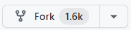

# GDSC GHRCEM

This is a repository for you to pratice and make pull request by adding
your character card to our website.


## Instructions:

- Fork the project:
  Click the gray `Fork` button in the top right of this page. This creates _your_ copy of the project and saves it as a new repository in your github account



- Click on the green `Code` button, then either the HTTPS or SSH option and, click the icon to copy the URL. Now you have a copy of the project. Thus, you can play around with it locally on your computer.


- Run the following commands into a terminal window (Command Prompt, Powershell, Terminal, Bash, ZSH). Do this to download the forked copy of this repository to your computer.

```bash
  git clone Copied_Link
```

- Switch to the cloned folder. You can paste this command into the same terminal window.

```bash
  cd gdscghrcem.github.io
```

- Open the colned files in vs-code

```bash
  code .
```

- Make a new branch. Your username would make a good branch because it's unique.

```bash
  git checkout -b <name-of-new-branch>
```

- Open the `assets` folder and paste your image, preferably in 7:6 ratio there.
- Then open the `index.html` file and paste the below code of the card alloted to you below the line that says "`<!--Add your card below this line -->`"

```html
<!--card start-->
<div class="card mb-3 card-bg my-4" style="max-width: 100%;">
  <div class="row no-gutters">
    <div class="col-md-4 p-0 ">
      <!-- Replace image_name_here with the complete name (with extension) of the image you uploaded -->
      
    </div>
    <div class="col-md-8 card-custom">
      <div class="card-body">
        <h2 class="card-title">[Your Character Name]</h2>
        <p class="card-text">
          [Your Character Info 1 (2 sentences preferably)]
        </p>
        <p class="card-text">
          [Your Character Info 2 (2 sentences preferably)]
        </p>
        <hr />
        <p class="card-text">Contributed by - [Your Name]]</p>
      </div>
    </div>
  </div>
</div>
<!--Sample [Character Name] card end-->
<!--Add your card below this line -->
```

- Stage your changes.

```bash
  git add .
```

- Commit the changes.

```bash
  git commit -m "Added My Card"
```

- Check the status of your repository.

```bash
  git status
```

- The response should be like this:

```bash
On branch <name-of-your-branch>
nothing to commit, working tree clean
```

- Pushing your repository to GitHub.

```bash
  git push -u origin <name-of-your-branch>
```

or

```bash
  git branch -M main
  git push -u origin main
```

---

## Additional Resources

- Command to install git using cli

```bash
winget install --id Git.Git -e --source winget
```

- Command to run if it's your first GitHub push

```bash
git config –global user.name “Your Name”
git config –global user.email “Your Email”
```
``` Test Commit ```
